# Hi there! 👋 I'm János Balogh (HDMI)

I am a **Full-Stack Developer** passionate about crafting seamless digital experiences. As a graduating technical IT student, I focus on building robust, scalable applications while bridging the gap between clean code and intuitive UI/UX design.

### 📈 GitHub Stats

---

### 🛠 Tech Stack
* **Frontend:** React, React Native (Expo), TypeScript, Tailwind CSS
* **Backend:** Node.js, NestJS, PostgreSQL, Prisma ORM
* **Design & UX:** Figma (Prototyping, Wireframing, UI Design)
* **Tools & DevOps:** Docker, Docker Compose, Git, GitHub Actions

### 🚀 Featured Project: Readsy
*A comprehensive book discovery and rating platform.*
* **Concept:** Developed a full-stack monorepo application to streamline the book discovery experience.
* **Key Contribution:** Implemented a complex backend architecture with Prisma and PostgreSQL, coupled with a responsive, user-centric mobile frontend.
* **Design Focus:** I am deeply invested in the intersection of UI/UX design and mobile development, ensuring that applications are not only functional but also intuitive and visually compelling.
* [Available here](https://github.com/20HDMI04/End-Term-Project)

### 💡 What I'm Looking For
I am currently seeking junior developer opportunities where I can:
* Leverage my expertise in **React Native** to build high-performance mobile apps.
* Apply my **UI/UX design principles (Figma)** to create user-friendly, accessible interfaces.
* Collaborate in an agile team and contribute to full-stack projects.

---

📫 **How to reach me:** baloghjanos20041208@gmail.com | [LinkedIn](https://www.linkedin.com/in/j%C3%A1nos-balogh-289009410)
💼 **Based in:** Budapest, Hungary
